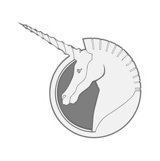

# Project Unicorn

> NCU machine learning course final project

## Motivation and Goal

- **Motivation**

  At first, we wanted to build a model to predict stock based on the analysis of ptt users' discussion.
  After some research, we found that idea is somewhat difficult for us.
  But fortunately, we discovered an interesting data set on Kaggle which is about the start-ups.
  Also, it's related to our original idea about predicting prospect of a stock/company, so we came up with a new plan based on this data set.

  [Startups Valued at $1 Billion or More](https://www.kaggle.com/datasets/thedevastator/startups-valued-at-1-billion-or-more)
- **Goal**
	- Provide a interactive and fun way to know about start-ups.
	- Give some possible invest targets.
	- Find out the key traits of a company to be successful.
	- Passing the class.

## Related Work / Market Survey

### What is "Unicorn" ?

“Unicorn”, Aileen Lee called a successful company, refers to a privately held startup company with a value of over $1 billion.

Our work is to know the potential of this company whether it could become a “Unicorn” company or not, in the other word, the probability of becoming a “Unicorn” company will be our target value.

The feature of explanatory value used for fitting the model will be company’s funding date, industries, financial, people, technology.

### CrunchBase

 In order to gain these features ,we consider to use the data from CrunchBase,a web database about start-ups, including various type of data such as founder, finance, and investors, etc.

The original source of the data set we use is from here.

## Users

- **Investors** that are seeking a practical way to know if a start-up will become a unicorn.
- People that are **seeking the chance to enter a start-up**.
- **Startup founders** who want to evaluate the their own or other's company by objective index(s).

## Explanation of Product Features

### Backend: NT-D

> Algorithm to Predict the Future Development of Start-up Companies

### Frontend: La+ Program

> UI to Interact with NT-D

Since we won’t want users to see directly into our code, we will have a UI for users to Interact with NT-D.UI will show the user the possibility if a start-up will become a unicorn. Suggest the users what features they should focus on. By default, showing what are in common between unicorns gives the users idea to deploy their resource.

- Features
- [ ] Show the possibility if a start-up will become a unicorn.
- [ ] Show what are in common between unicorns.

## The Solution Architecture

[//]: # (&#40;Describe of product solutions and techniques&#41;)

### Tech Stack

- Python 3.10.8
powerful programming language, able to use the package we need.*
- [PyTorch](https://github.com/pytorch/pytorch)
PyTorch has tensor computation (like NumPy) with strong GPU acceleration to shorten our training time. DNN we used will be built on a tape-based autograd system. NumPy, SciPy, and Cython are all able to extend PyTorch. PyTorch also has multiprocessing which is useful for data loading and Hogwild training.
- [PyTorch Lightning](https://github.com/pytorch/pytorch)
PyTorch Lightning can make the PyTorch model easier to build, connect, optimize.
- [Rust](https://github.com/rust-lang/rust)
Rust is memory-efficient; it can power performance-critical services, run on embedded devices, and easily integrate with other languages. It is also memory-safety and thread-safety. Publish to the network would have more reliability by using Rust.
- [Tauri](https://github.com/tauri-apps/tauri)
Tauri is a framework for building tiny, blazingly fast binaries for all major desktop platforms. Developers can integrate any front-end framework that compiles to HTML, JS and CSS for building their user interface. The backend of the application is a rust-sourced binary with an API that the front-end can interact with.

### Architecture

## Reference

[//]: # (https://ithelp.ithome.com.tw/articles/10252383?sc=pt)
